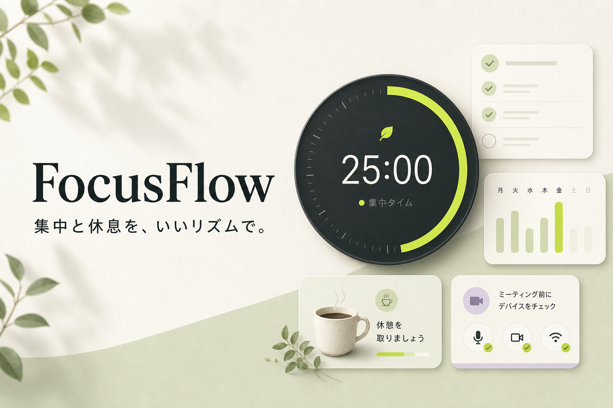

# FocusFlow

集中・休憩・記録・会議準備をひとつにまとめた、PC / iPhone向けの作業管理PWAです。

[Live Demo](https://focusflow.0404taichi8.workers.dev/)



## Concept

FocusFlowは、作業を「始める」「続ける」「休む」「振り返る」「会議へ切り替える」までを一つの流れとして扱うプロダクトです。

単なるポモドーロタイマーではなく、タスク、集中セッション、休憩リマインダー、通知の一時保留、会議前チェック、実績グラフをまとめることで、作業中にアプリを行き来する負担を減らすことを目指しました。

PCでは広いダッシュボードとして、iPhoneではPWAとしてホーム画面から使えるように設計しています。

## Main Features

- ポモドーロタイマー
  - 集中 / 休憩モード
  - 15 / 25 / 45 / 60分プリセット
  - 一時停止、リセット、5分延長
  - タブ移動やPWA復帰後も終了予定時刻から残り時間を補正

- タスク管理
  - 今日のタスク追加、完了、削除
  - タスクごとの見積もりポモドーロ数
  - 集中セッションとタスクの紐づけ

- 作業記録・実績グラフ
  - 今日の集中時間
  - 完了タスク数
  - 直近7日間の集中時間
  - 最近の集中セッション履歴

- 休憩リマインダー
  - ページ内の操作状況から連続作業時間を推定
  - 長時間作業時に休憩を促すカードを表示

- 通知抑制タイマー
  - 集中中はアプリ内通知をキューに保留
  - 集中終了後にまとめて確認できる設計

- 会議前チェッカー
  - マイク確認
  - カメラ確認
  - スピーカーテスト
  - 通信応答チェック

- アカウント認証・同期
  - メールアドレス / パスワード認証
  - HTTP-only Cookieによるセッション管理
  - Cloudflare D1にアカウントごとのタスク、設定、集中履歴を保存
  - 未ログイン状態ではブラウザのLocalStorageに保存

- PWA対応
  - ホーム画面追加
  - Service Worker
  - オフライン時のフォールバック
  - PC / iPhoneに合わせたレスポンシブUI

## Why I Built This

集中系アプリは、タイマーだけ、タスクだけ、記録だけに分かれていることが多く、実際の作業では複数のツールを切り替える必要があります。

FocusFlowでは、作業中に必要になる機能を一つの画面に統合し、「集中を始める前の準備」と「集中した後の振り返り」までを自然につなげることを意識しました。

特にこだわったのは、次の3点です。

1. タイマーがリセットされないこと  
   タブ移動、画面復帰、設定変更などで集中時間が失われないよう、終了予定時刻を保存して補正しています。

2. ローカル保存とアカウント同期の両立  
   すぐ使えるLocalStorage保存を残しつつ、ログイン後はD1へ同期できる構成にしました。

3. Webアプリとして現実的な制約を明示的に扱うこと  
   ブラウザではOS全体の通知制御やスマホの完全なバックグラウンド実行はできないため、PWA・通知許可・復帰時補正を組み合わせて実用性を高めています。

## Tech Stack

| Area | Technology |
| --- | --- |
| Language | TypeScript |
| UI | React 19 |
| Framework | Next.js 16 / vinext |
| Build | Vite |
| Styling | CSS |
| Auth | Custom email/password auth, HTTP-only Cookie |
| Database | Cloudflare D1 |
| ORM / Migration | Drizzle |
| Hosting | Cloudflare Workers |
| PWA | Web App Manifest, Service Worker |

## Architecture

```text
Browser / PWA
  ├─ LocalStorage
  │   └─ 未ログイン時のタスク・設定・集中履歴
  │
  └─ API Routes
      ├─ /api/auth
      │   └─ アカウント作成、ログイン、ログアウト
      │
      ├─ /api/sync
      │   └─ ユーザーごとの作業データ同期
      │
      └─ /api/diagnostics
          └─ D1接続状態の確認

Cloudflare Workers
  └─ Cloudflare D1
      ├─ users
      ├─ auth_sessions
      └─ user_app_states
```

## Browser and PWA Constraints

このアプリはWebブラウザ上で動作するため、OSネイティブアプリと同じことがすべてできるわけではありません。

- スマートフォンでは、PWAが常にバックグラウンドで実行されるとは限りません
- OS全体の通知を直接抑制することはできません
- PC全体の操作状況を完全に取得することはできません

そのためFocusFlowでは、以下のようにWebで実現可能な方法へ落とし込んでいます。

- タイマーは終了予定時刻を保存し、復帰時に残り時間を再計算
- 通知抑制はアプリ内通知キューとして実装
- 休憩判定はページ内の操作状況をもとに推定
- ブラウザ通知はユーザーが許可した場合のみ利用

## Local Setup

```bash
npm install
npm run dev
```

Build:

```bash
npm run build
```

Test:

```bash
npm test
```

## Deployment

Cloudflare Workersへのデプロイを想定しています。

```bash
npm run deploy
```

Cloudflare側では、D1 binding名を `DB` に設定します。  
デプロイ時に `drizzle/` のマイグレーションをD1へ適用し、その後Workerを公開します。

## Project Structure

```text
app/
├── focus-dashboard.tsx      # メインUI、タイマー、タスク、設定、同期処理
├── globals.css              # レイアウト、レスポンシブ、PWA向けスタイル
├── layout.tsx               # メタデータ、PWA、OGP設定
├── page.tsx                 # エントリーページ
└── api/
    ├── auth/route.ts        # 認証API
    ├── sync/route.ts        # アカウントデータ同期API
    ├── diagnostics/route.ts # D1診断API
    └── _lib/                # 認証・D1接続ユーティリティ

drizzle/
└── *.sql                    # D1 migration

public/
├── manifest.webmanifest     # PWA manifest
├── sw.js                    # Service Worker
├── offline.html             # オフラインフォールバック
└── og.png                   # SNSプレビュー画像
```

## Future Improvements

- BGM / 環境音モード
- カレンダー連携による会議前チェックの自動表示
- 月次レポート、CSVエクスポート
- タグ別・プロジェクト別の集中時間分析
- ネイティブアプリ化によるOSレベルの通知制御

---

FocusFlow is a productivity PWA designed to make focus work feel less fragmented: start a task, protect the session, take a break, and review the day in one place.
